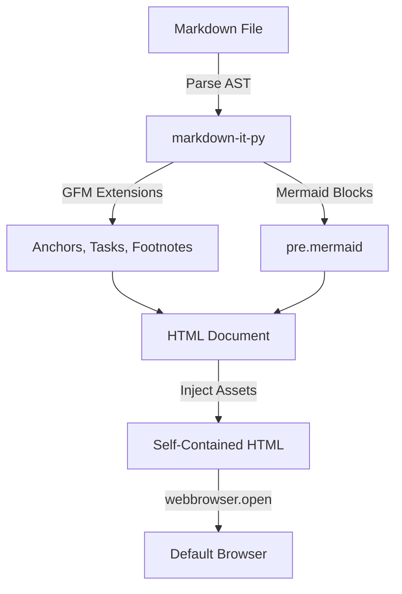
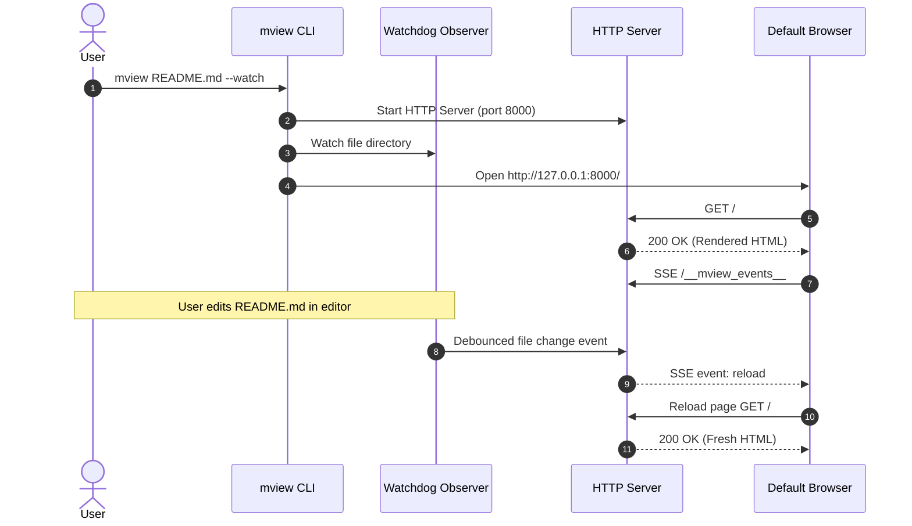
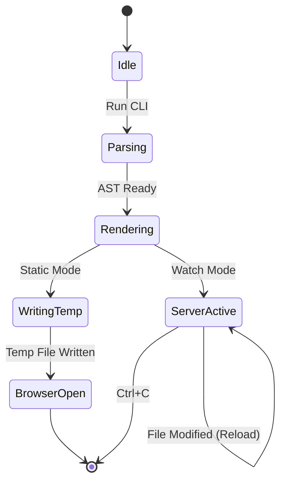

# mview Sample Showcase :rocket:

Welcome to the **mview** feature showcase! This file demonstrates every GitHub-Flavored Markdown (GFM) feature rendered completely **offline**, matching GitHub's official styling.

---

## Table of Contents

- [Task Lists & Strikethrough](#task-lists--strikethrough)
- [Tables & Alignment](#tables--alignment)
- [Footnotes Support](#footnotes-support)
- [Syntax Highlighted Code Blocks](#syntax-highlighted-code-blocks)
- [Relative Local Images](#relative-local-images)
- [GitHub Alert Callouts](#github-alert-callouts)
- [Mermaid Diagrams](#mermaid-diagrams)
- [Graceful Mermaid Error Handling](#graceful-mermaid-error-handling)
- [Autolinks & Emojis](#autolinks--emojis)

---

## Task Lists & Strikethrough

Track progress with GitHub-style checkboxes and strike through completed milestones:

- [x] Initial research & architecture plan
- [x] Vendor offline assets (`github-markdown-css`, `highlight.js`, `mermaid.js`)
- [x] Implement GFM parser with `markdown-it-py`
- [x] GitHub-compliant slugged heading anchors with hover link icons
- [x] Footnote support with return references
- [x] Relative image path resolution (Base64 data URI offline)
- [x] Native Mermaid rendering with graceful error recovery
- [x] Live reload server with watchdog (`--watch`)
- [ ] ~~Legacy browser polyfills~~ (Not needed!)
- [ ] Next generation offline preview features

---

## Tables & Alignment

Tables render with Primer borders, zebra stripes, and cell alignments:

| Feature | Supported | Offline Bundle | Mode |
| :--- | :---: | :---: | ---: |
| **Tables** | :white_check_mark: Yes | Native CSS | Static & Watch |
| **Task Lists** | :white_check_mark: Yes | Native CSS | Static & Watch |
| **Code Highlighting** | :white_check_mark: Yes | `highlight.js` (11.12.0) | Static & Watch |
| **Mermaid Diagrams** | :white_check_mark: Yes | `mermaid.js` (10.9.8) | Static & Watch |
| **Live Reload** | :white_check_mark: Yes | SSE / Polling | Watch (`-w`) |
| **Zero CDN Calls** | :lock: 100% | Inlined | All |

---

## Footnotes Support

Here is an example of an inline footnote reference[^1]. You can also reference a second footnote with more detailed information[^arch-note].

Clicking the footnote number jumps to the section at the bottom, and clicking the return arrow jumps right back here.

---

## Syntax Highlighted Code Blocks

Code blocks use bundled `highlight.js` with light and dark themes that automatically track your operating system's color scheme preference:

### Python

```python
from pathlib import Path
from mview.parser import create_markdown_parser
from mview.renderer import setup_renderer

def render_markdown(file_path: Path) -> str:
    """Render markdown file to GitHub-styled HTML."""
    parser = create_markdown_parser()
    setup_renderer(parser, file_path.parent)
    return parser.render(file_path.read_text(encoding="utf-8"))
```

### TypeScript / JavaScript

```typescript
interface PreviewOptions {
  watch: boolean;
  port?: number;
  openBrowser: boolean;
}

export async function previewFile(filePath: string, opts: PreviewOptions): Promise<void> {
  console.log(`Rendering ${filePath} with live-reload=${opts.watch}`);
}
```

### Rust

```rust
use std::path::Path;

pub struct MarkdownViewer {
    target: String,
    port: u16,
}

impl MarkdownViewer {
    pub fn new(target: &str) -> Self {
        Self { target: target.to_string(), port: 8080 }
    }
}
```

---

## Relative Local Images

Relative image links are automatically resolved against the markdown file's directory. In static preview mode, local images are seamlessly converted to inline data URIs so they load properly without browser local-file cross-origin restrictions:


HTML `` tags also resolve:


---

## GitHub Alert Callouts

GitHub-style alerts withPrimer Octicon icons:

> [!NOTE]
> This is a helpful note alert. Useful for providing additional context or tips.

> [!TIP]
> Run `mview <file.md> --watch` while editing your document to see instant live updates in your browser!

> [!IMPORTANT]
> All JavaScript and CSS dependencies are bundled inside the package — no CDN or internet connection is required.

> [!WARNING]
> Do not edit generated HTML files directly, as they are regenerated from the source markdown on each save.

> [!CAUTION]
> Be mindful when opening untrusted markdown files that contain arbitrary inline HTML.

---

## Mermaid Diagrams

Mermaid diagrams are rendered directly in the browser using the vendored `mermaid.min.js`:

### Flowchart



### Sequence Diagram



### State Diagram



---

## Graceful Mermaid Error Handling

If a Mermaid diagram contains a syntax error, `mview` gracefully catches the error and renders an inline error box instead of crashing the page or breaking other diagrams:

```mermaid
graph INVALID
    This is not valid mermaid syntax ->> ???
    [error block demonstration]
```

The rest of the document continues to render without issue!

---

## Autolinks & Emojis

- Autolinks: Visit https://github.com or https://python.org.
- Email: sample@example.com
- Emojis: :sparkles: :tada: :fire: :heart: :checkered_flag: :bulb: :art: :zap:

---

[^1]: This is the first footnote text, rendered at the bottom of the document.
[^arch-note]: `mview` embeds `github-markdown-css`, `highlight.js`, and `mermaid.js` locally for 100% offline functionality.
